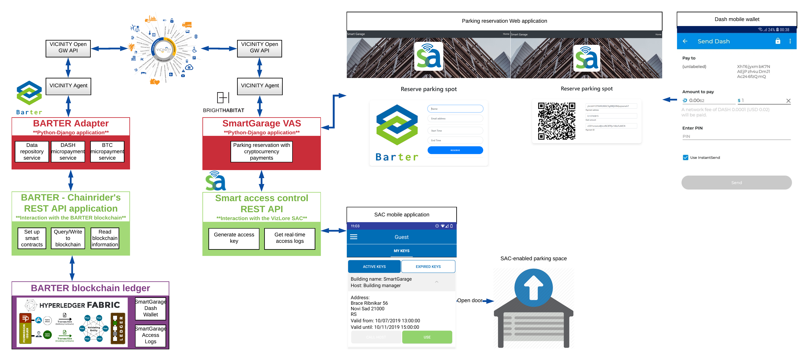
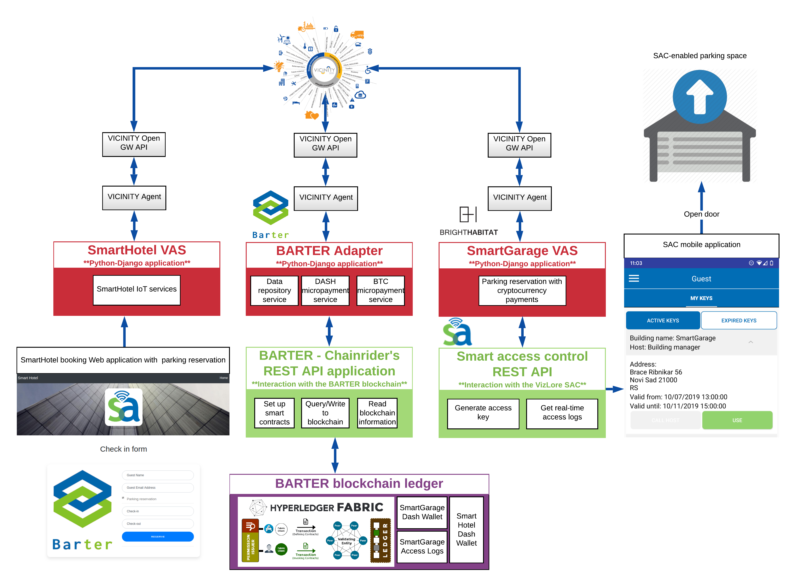

# SmartHotel VAS

The SmartHotel VAS colaborates with BARTER (private and public blockchain) and VizLore Smart Access Solutions (smart access control and actuation) to showcase automated M2M parking reservation and payments (Scenario 2). This VAS offers to reserve parking for hotel guests together with room reservation. The parking reservation and payment are completely automated, and handled by [BARTER Adapter](https://github.com/vicinityh2020/vicinity-adapter-barter) and [SmartGarage VAS](https://github.com/vicinityh2020/vicinity-vas-smartgarage). 

# About BARTER 

BARTER is a blockchain framework built on top of open source projects Hyperledger Fabric, Dash and Bitcoin and proprietary VizLore’s [ChainRider service](https://chainrider.io/). It is a micro-payment enabler service that can be exploited to support a range of use-cases that need a secure and scalable M2M micro-payment solution specifically designed for IoT ecosystem.

# Smart Parking Scenarios

There are two smart parking reservation scenarios covered within smart parking. 

The first one covers end user to platform/system parking reservation and payment. This scenario handles the situation when an end-user wants to reserve a smart parking spot at a smart garage, equipped with smart access automatic door unlocking. The platform offering the smart garage service is part of the BARTER ecosystem, and has a DASH wallet set up inside the BARTER private blockchain. The end-user is not essentially a part of the BARTER ecosystem, but rather want to use the service provided by the given platform – in this case the smart garage service. The end-user reserves the parking spot through a web dashboard, and is presented with a QR code for payment (in Dash). The QR code is scanned through the Dash mobile app on the users phone, and this payment is transferred to the wallet of the platform on BARTER. Once the payment is done, the user will receive a virtual key for his/her Smart Access Control Mobile application. When in close proximity to the smart garage door, using the SAC mobile app, user is able to open the door, and park his/her car. 

A working demonstration of this scenario can be viewed [here](https://www.youtube.com/watch?v=jrqIGyOWNDU). 

The second scenario covers autonomous platform to platform (M2M) parking reservation and payments. The scenario follows the same pattern as in (1). In this case direct, automated platform-to-platform parking reservation and payments are covered, without involving human users. There are two sides – service provider and service consumer, and both are platforms in the VICINITY ecosystem. The first platform is offering the smart garage service, and the other platform wants to reserve smart garage parking spots. Both platforms have Dash wallets on BARTER private blockchain, and all reservation requests and payments between the two platforms are completely automated. In this scenario, end-users do not handle payments/reservations, everything is automated between the two platforms. They are only using the end-result of the entire workflow – the virtual key, to unlock the smart garage door using the  Smart Access Control Mobile application.

A working demonstration of this scenario can be viewed [here](https://www.youtube.com/watch?v=CD2j8u2hmUs). 

